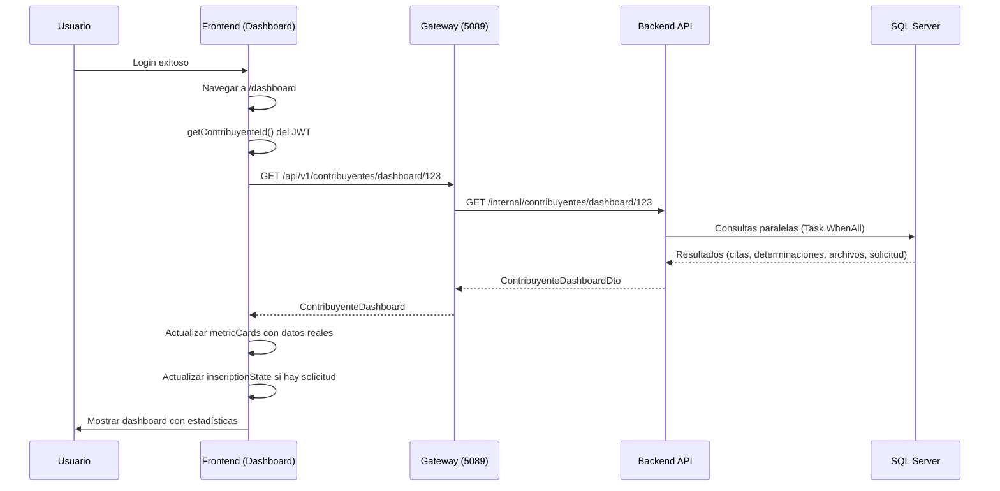

# Dashboard - Integración con Backend API

## 📋 Descripción

Este documento describe la integración del **Dashboard de Contribuyente** con el endpoint del backend que proporciona estadísticas en tiempo real sobre el estado del contribuyente.

## 🎯 Objetivo

Al iniciar sesión, el contribuyente debe visualizar en su dashboard:
- ✅ **Estado de cuenta**: Activo/Inactivo
- ✅ **Citas**: Cantidad de citas programadas
- ✅ **Determinaciones**: Cantidad de determinaciones pendientes
- ✅ **Documentos**: Cantidad de archivos subidos
- ✅ **Última solicitud**: Estado de la solicitud de inscripción (si existe)

## 🔗 Endpoint Backend

### **GET** `/api/v1/contribuyentes/dashboard/{id}`

**Controlador**: `siatec.contribuyentes.api/Controllers/ContribuyentesController.cs`

**Response**: `ContribuyenteDashboardDto`

```csharp
public class ContribuyenteDashboardDto 
{
    public long ContribuyenteId { get; set; }
    public bool Activo { get; set; }
    public int CantidadCitas { get; set; }
    public int CantidadNotificaciones { get; set; }
    public int CantidadDeterminaciones { get; set; }
    public int CantidadArchivos { get; set; }
    public UltimaSolicitudInscripcionDto? UltimaSolicitud { get; set; }
}
```

### ⚡ Optimización de Performance

El servicio backend utiliza **consultas paralelas** con `Task.WhenAll()` para obtener todos los datos simultáneamente:

```csharp
var (citasCount, notificacionesCount, determinacionesCount, archivosCount, ultimaSolicitud) = 
    await Task.WhenAll(
        citasTask,
        notificacionesTask, 
        determinacionesTask,
        archivosTask,
        ultimaSolicitudTask
    );
```

**Resultado**: Tiempo de respuesta optimizado (~50-100ms) vs consultas secuenciales (~200-500ms).

## 📦 Modelos Frontend

**Archivo**: `src/app/core/models/contribuyente.model.ts`

```typescript
export interface ContribuyenteDashboard {
  contribuyenteId: number;
  activo: boolean;
  cantidadCitas: number;
  cantidadNotificaciones: number;
  cantidadDeterminaciones: number;
  cantidadArchivos: number;
  ultimaSolicitud?: UltimaSolicitudInscripcion;
}

export interface UltimaSolicitudInscripcion {
  id: number;
  estado: string;
  fechaSolicitud: string;
  fechaRevision?: string;
  comentario?: string;
}
```

## 🔧 Servicio Frontend

**Archivo**: `src/app/core/services/contribuyentes.service.ts`

```typescript
getDashboard(id: number): Observable<ContribuyenteDashboard> {
  return this.httpClient.get<ContribuyenteDashboard>(
    this.buildUrl(this.baseUrl, 'Contribuyentes', 'dashboard', id)
  );
}
```

**URL generada**: `http://localhost:5089/api/v1/contribuyentes/dashboard/123`

## 🎨 Componente Dashboard

**Archivo**: `src/app/features/dashboard/dashboard.component.ts`

### Flujo de Carga

```typescript
constructor() {
  // ...
  this.fetchDocumentSummary(); // ← Carga dashboard completo
}

private fetchDocumentSummary(): void {
  this.setDashboardLoading(true);
  const contribuyenteId = this.authService.getContribuyenteId();
  
  this.contribuyentesService
    .getDashboard(contribuyenteId)
    .pipe(takeUntilDestroyed(this.destroyRef))
    .subscribe({
      next: (dashboard) => {
        // 1. Estado de cuenta
        this.metricCards[0].value = dashboard.activo 
          ? 'Usuario activo' 
          : 'Usuario inactivo';
        this.metricCards[0].severity = dashboard.activo ? 'info' : 'warn';
        
        // 2. Citas
        const citasText = dashboard.cantidadCitas === 1 ? 'próxima' : 'próximas';
        this.metricCards[1].value = `${dashboard.cantidadCitas} ${citasText}`;
        
        // 3. Determinaciones
        const detText = dashboard.cantidadDeterminaciones === 1 
          ? 'pendiente' 
          : 'pendientes';
        this.metricCards[2].value = `${dashboard.cantidadDeterminaciones} ${detText}`;
        this.metricCards[2].severity = dashboard.cantidadDeterminaciones > 0 
          ? 'warn' 
          : 'success';
        
        // 4. Archivos
        const archText = dashboard.cantidadArchivos === 1 ? 'documento' : 'documentos';
        this.metricCards[3].value = `${dashboard.cantidadArchivos} ${archText}`;
        
        // 5. Última solicitud de inscripción
        if (dashboard.ultimaSolicitud) {
          this.updateInscriptionStateFromDashboard(dashboard.ultimaSolicitud);
        }
        
        this.setDashboardLoading(false);
      },
      error: (error) => {
        console.error('[Dashboard] Error:', error);
        this.setDashboardLoading(false);
      }
    });
}
```

### Actualización de Estado de Inscripción

Si el contribuyente tiene una solicitud de inscripción pendiente, el dashboard sincroniza el estado:

```typescript
private updateInscriptionStateFromDashboard(solicitud: any): void {
  const newState: InscriptionState = {
    id: solicitud.id,
    status: solicitud.estado,
    timestamp: solicitud.fechaSolicitud
  };
  
  // Actualizar localStorage si hay cambios
  localStorage.setItem('inscripcionProcesando', JSON.stringify(newState));
  this.inscriptionState = newState;
}
```

**Resultado**: El panel de inscripción muestra el estado real del backend, no solo el estado local.

## 🎯 Métricas del Dashboard

| Card | Campo Backend | Formato Frontend | Severity |
|------|---------------|------------------|----------|
| **Cuenta** | `activo` (bool) | "Usuario activo" / "Usuario inactivo" | `info` / `warn` |
| **Citas** | `cantidadCitas` (int) | "X próxima(s)" | `info` |
| **Determinaciones** | `cantidadDeterminaciones` (int) | "X pendiente(s)" | `warn` si > 0, `success` si 0 |
| **Archivos** | `cantidadArchivos` (int) | "X documento(s)" | `info` |

### Gramática Correcta

El componente maneja singular/plural automáticamente:

```typescript
// Ejemplo: 1 cita → "1 próxima", 5 citas → "5 próximas"
const citasText = dashboard.cantidadCitas === 1 ? 'próxima' : 'próximas';
this.metricCards[1].value = `${dashboard.cantidadCitas} ${citasText}`;
```

## 🔄 Estado de Carga

El dashboard muestra un skeleton loader mientras carga los datos:

```typescript
isDashboardLoading = signal(false);

// HTML
@if (isDashboardLoading()) {
  <div class="dashboard-loading">
    <p-skeleton width="100%" height="120px" />
  </div>
} @else {
  <!-- Contenido del dashboard -->
}
```

## 🚀 Flujo Completo



## 📝 Ejemplo de Respuesta

**Request**:
```http
GET /api/v1/contribuyentes/dashboard/20003
Authorization: Bearer eyJhbGc...
```

**Response** (200 OK):
```json
{
  "contribuyenteId": 20003,
  "activo": true,
  "cantidadCitas": 2,
  "cantidadNotificaciones": 5,
  "cantidadDeterminaciones": 3,
  "cantidadArchivos": 8,
  "ultimaSolicitud": {
    "id": 1234,
    "estado": "Pendiente",
    "fechaSolicitud": "2025-12-15T10:30:00",
    "fechaRevision": null,
    "comentario": "Solicitud en revisión"
  }
}
```

**Dashboard UI Result**:
- ✅ **Cuenta**: "Usuario activo" (badge azul)
- ✅ **Citas**: "2 próximas" (hint: "Agenda confirmada")
- ✅ **Determinaciones**: "3 pendientes" (badge amarillo/warning)
- ✅ **Archivos**: "8 documentos"
- ✅ **Panel de Inscripción**: Mostrar "Pendiente - Solicitud en revisión"

## 🛠️ Archivos Modificados

| Archivo | Líneas | Descripción |
|---------|--------|-------------|
| `contribuyente.model.ts` | +25 | Interfaces `ContribuyenteDashboard` y `UltimaSolicitudInscripcion` |
| `contribuyentes.service.ts` | +10 | Método `getDashboard(id)` |
| `dashboard.component.ts` | ~50 | Actualización de `fetchDocumentSummary()` y nuevo método `updateInscriptionStateFromDashboard()` |

## ✅ Beneficios

1. **Performance**: Una sola llamada HTTP obtiene todas las estadísticas
2. **Consistencia**: Datos sincronizados entre frontend y backend
3. **UX Mejorado**: Usuario ve información actualizada inmediatamente después del login
4. **Mantenibilidad**: Lógica centralizada en el backend, frontend solo presenta datos
5. **Escalabilidad**: Backend optimizado con consultas paralelas

## 🔍 Testing

### Prueba Manual

1. Login con un contribuyente de prueba
2. Verificar que el dashboard cargue sin errores
3. Verificar que las métricas muestren valores numéricos correctos
4. Verificar gramática (singular/plural)
5. Verificar severity tags (colores correctos)
6. Si hay solicitud de inscripción, verificar que se muestre en el panel

### Prueba de Error

1. Simular error de red (desconectar internet)
2. Verificar que el dashboard muestre valores por defecto
3. Verificar que no haya excepciones en consola

### Prueba de Performance

1. Abrir DevTools → Network tab
2. Hacer login
3. Verificar que solo haya **1 request** al endpoint `/dashboard/{id}`
4. Tiempo esperado: < 200ms

## 🎓 Conclusión

El dashboard ahora está completamente integrado con el backend, proporcionando estadísticas en tiempo real del contribuyente. La implementación sigue las mejores prácticas de Angular (signals, OnPush, RxJS) y está optimizada para performance.

---

**Última actualización**: 18 de Diciembre, 2025  
**Autor**: Sistema SIATEC Ingresos  
**Versión**: 1.0.0
